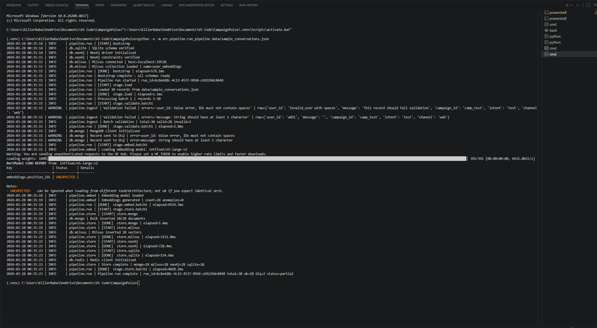
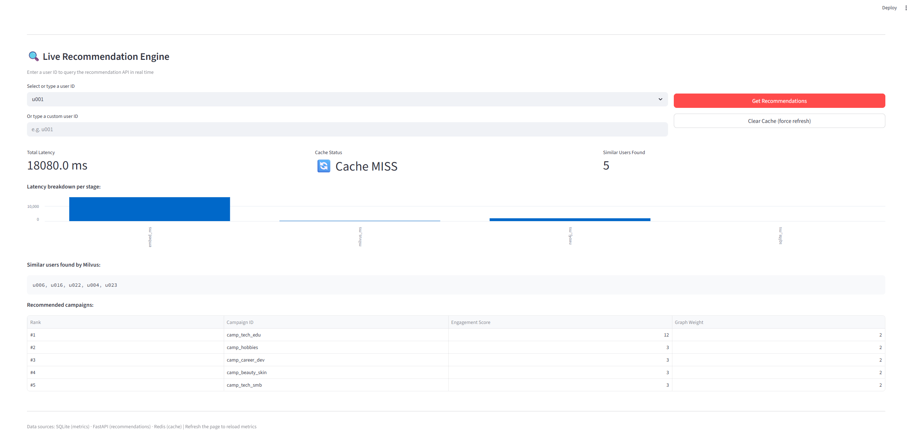
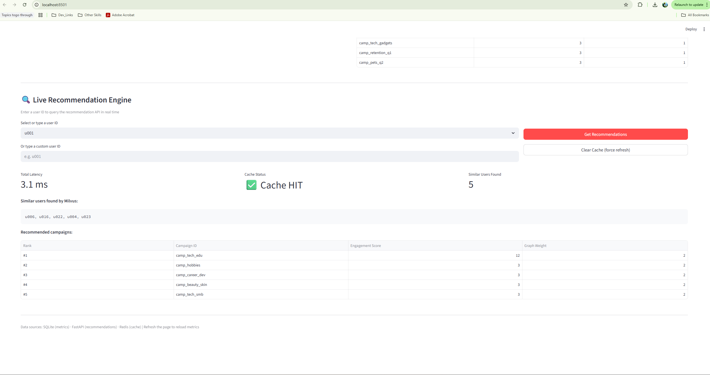
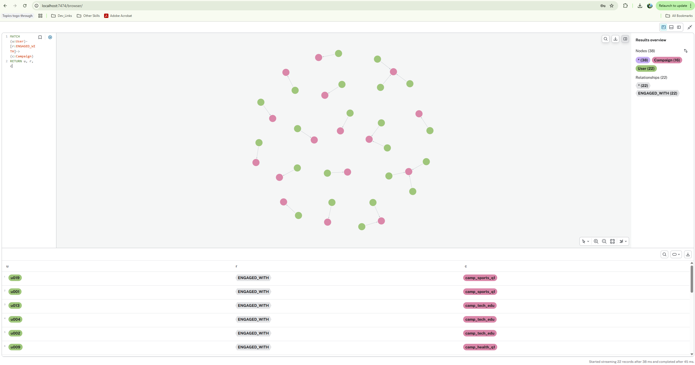
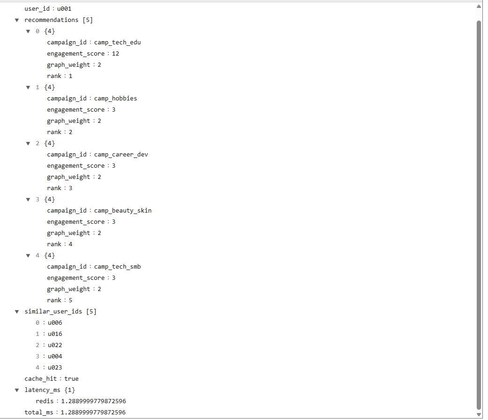

# 🎯 Marketing Personalisation Platform

> AI-driven campaign recommendation engine powered by a polyglot database stack — vector search, graph traversal, and real-time analytics unified in a single platform.


---

## What This Does

A user sends a chat message → the platform understands the **meaning** of that message → finds users who talk about **similar topics** → recommends campaigns that worked for those users → serves results in **<5ms** for repeat queries via Redis caching.

```
Chat Message → Embedding → Milvus (find similar users)
                                  → Neo4j  (their campaigns)
                                  → SQLite (rank by engagement)
                                  → Redis  (cache result)
                                  → API    (serve in <5ms)
```

---

## Architecture

| Store | Technology | Role |
|---|---|---|
| Document | MongoDB 7 | Raw conversations + dead-letter queue |
| Vector | Milvus 2.4 | 1024-dim semantic embeddings + ANN search |
| Graph | Neo4j 5 | User → Campaign → Intent relationships |
| Analytics | SQLite → BigQuery | Aggregated engagement metrics |
| Cache | Redis 7 | Session + recommendation cache (TTL 5min) |
| Embeddings | `intfloat/e5-large-v2` | Sentence-Transformers, 1024-dim |
| API | FastAPI + Uvicorn | `/recommendations/<user_id>` |
| Orchestration | Python DAG / Airflow | ETL pipeline |
| Dashboard | Streamlit | Live metrics + recommendation demo |

→ Full design decisions and trade-offs: [`architecture.md`](./architecture.md)
→ End-to-end data flow diagrams: [`data_flow.md`](./data_flow.md)
→ Scaling to 10M+ users: [`scaling_plan.md`](./scaling_plan.md)

---

## Prerequisites

- Docker Desktop 20+
- Python 3.10+

---

## Quickstart

### 1. Start infrastructure

```bash
docker compose up -d
```

Wait ~60s for all services to become healthy:
```bash
docker compose ps   # all should show "healthy"
```

### 2. Python environment

```bash
python -m venv .venv && .venv\Scripts\activate   # Windows
python -m venv .venv && source .venv/bin/activate # Mac/Linux

pip install -r requirements.txt
```

### 3. Run the pipeline

```bash
python -u -m src.pipeline.run_pipeline data/sample_conversations.json
```

Expected output:
```
Pipeline run complete | total=30 ok=28 dlq=2 status=partial
```

> The 2 DLQ records are intentional — sample data includes a blank message
> and a user_id with spaces to demonstrate schema validation.

> First run downloads the embedding model (~1.3GB, cached after that).

### 4. Start the API

```bash
python -u -m uvicorn src.api.main:app --host 0.0.0.0 --port 8000 --reload
```

### 5. Launch the dashboard

Open a new terminal:

```bash
python -u -m streamlit run streamlit_dashboard.py
```

---

## Service URLs

| Service | URL | Credentials |
|---|---|---|
| FastAPI (Recommendations API) | http://localhost:8000 | — |
| FastAPI Interactive Docs | http://localhost:8000/docs | — |
| Streamlit Dashboard | http://localhost:8501 | — |
| Neo4j Browser | http://localhost:7474 | neo4j / neo4j123 |
| MinIO Console (Milvus storage) | http://localhost:9001 | minioadmin / minioadmin123 |
| MongoDB | localhost:27017 | admin / admin123 |
| Redis | localhost:6379 | password: redis123 |
| Milvus gRPC | localhost:19530 | — |

---

## API

### `GET /recommendations/{user_id}`

Three-stage hybrid retrieval — Milvus → Neo4j → SQLite, cached in Redis.

```bash
curl http://localhost:8000/recommendations/u001
```

```json
{
  "user_id": "u001",
  "recommendations": [
    { "campaign_id": "camp_tech_edu", "engagement_score": 4, "graph_weight": 4, "rank": 1 }
  ],
  "similar_user_ids": ["u016", "u013", "u004", "u002", "u010"],
  "cache_hit": false,
  "latency_ms": { "embed_ms": 45.2, "milvus_ms": 18.4, "neo4j_ms": 31.7, "sqlite_ms": 2.1 },
  "total_ms": 98.4
}
```

| Path | Latency |
|---|---|
| Cache hit (Redis) | ~2ms |
| Cache miss (full retrieval) | ~100–200ms |

---

## Screenshots

### Successful Pipeline Run


### API Response — Cache Miss (full retrieval)


### API Response — Cache Hit (Redis, ~2ms)


### Neo4j Graph — User → Campaign Relationships


### API Response Structure


---

## Project Structure

```
├── dags/
│   └── pipeline_dag.py        # Airflow DAG (PythonOperator per stage)
├── src/
│   ├── utils/
│   │   ├── config.py          # Central env-var loader
│   │   └── logger.py          # Structured logger with timing
│   ├── db/
│   │   ├── mongo.py           # MongoDB client + DLQ routing
│   │   ├── redis_client.py    # Session + recommendation cache
│   │   ├── neo4j_client.py    # Graph upserts + Cypher queries
│   │   ├── milvus_client.py   # Collection setup + ANN search
│   │   └── sqlite_client.py   # Schema + engagement scoring
│   ├── pipeline/
│   │   ├── ingest.py          # Pydantic validation + lineage tagging
│   │   ├── embed.py           # Sentence-Transformer + anomaly detection
│   │   ├── store.py           # Fan-out writes to all 4 stores
│   │   └── run_pipeline.py    # DAG orchestrator — entry point
│   └── api/
│       └── main.py            # FastAPI — /recommendations/<user_id>
├── data/
│   └── sample_conversations.json
├── Screenshots/
│   ├── Successfull_pipeline_run.png
│   ├── Api_response_structure.png
│   ├── Neo4j_Vector_Distribution.png
│   ├── Streamlit_api_response_cache_hit.png
│   └── Streamlit_api_response_cache_miss.png             
├── streamlit_dashboard.py     # Streamlit metrics dashboard
├── docker-compose.yml
├── .env
├── requirements.txt
├── architecture_diagram.md    # Mermaid system diagram
├── Architecture_Diagram.png   # PNG export of architecture diagram
├── architecture.md            # Design decisions + trade-offs
├── data_flow.md               # End-to-end data movement diagrams
└── scaling_plan.md            # 10M+ users scaling roadmap
```

---

## Documentation

| Document | Description |
|---|---|
| [`architecture.md`](./architecture.md) | Design decisions and trade-offs for every component |
| [`architecture_diagram.md`](./architecture_diagram.md) | Mermaid system diagram |
| [`data_flow.md`](./data_flow.md) | End-to-end data movement across every layer |
| [`scaling_plan.md`](./scaling_plan.md) | How to evolve this to 10M+ users |

---

## Observability

Every pipeline run and API request emits structured logs:

```
2026-03-27 13:53:54 | INFO  | pipeline.store | store.mongo  | elapsed=14.0ms
2026-03-27 13:53:57 | INFO  | pipeline.store | store.milvus | elapsed=3103.0ms
2026-03-27 13:53:58 | INFO  | pipeline.store | store.neo4j  | elapsed=963.5ms
2026-03-27 13:53:58 | INFO  | pipeline.run   | Pipeline run complete | total=30 ok=28 dlq=2
```

Anomaly detection fires on:
- Empty / near-zero embeddings → logged + excluded from Milvus
- Validation failures → routed to MongoDB dead-letter queue
- Neo4j upsert failures → logged with lineage_id for tracing

---

## Key Design Decisions

**Why 5 databases?**
Each store is chosen for what it does best — no single database handles semantic search, graph traversal, document flexibility, and analytical aggregation equally well.

**Why `intfloat/e5-large-v2` for embeddings?**
It outputs exactly 1024 dimensions as required, runs on CPU with no GPU needed, and ranks consistently at the top of the MTEB benchmark.

**Why Python DAG over Airflow by default?**
The pipeline is structured so each stage is a pure function. The `dags/pipeline_dag.py` wraps each in a `PythonOperator` with zero logic changes — swap the scheduler, not the code.

**Why Redis TTL caching?**
The recommendation endpoint makes 3 DB round-trips on a cache miss (~200ms). Redis reduces repeat queries to ~2ms. 5-minute TTL balances freshness vs latency; cache is also actively invalidated on new pipeline runs.

---

## Useful Commands

```bash
# View all service logs
docker compose logs -f

# Wipe everything and start fresh
docker compose down -v && docker compose up -d

# Check pipeline run history
python -c "
import sqlite3; conn = sqlite3.connect('data/analytics.db')
conn.row_factory = sqlite3.Row
for r in conn.execute('SELECT * FROM pipeline_runs').fetchall(): print(dict(r))
"
```